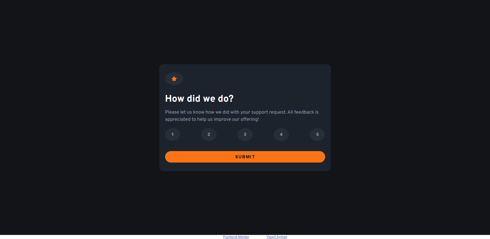
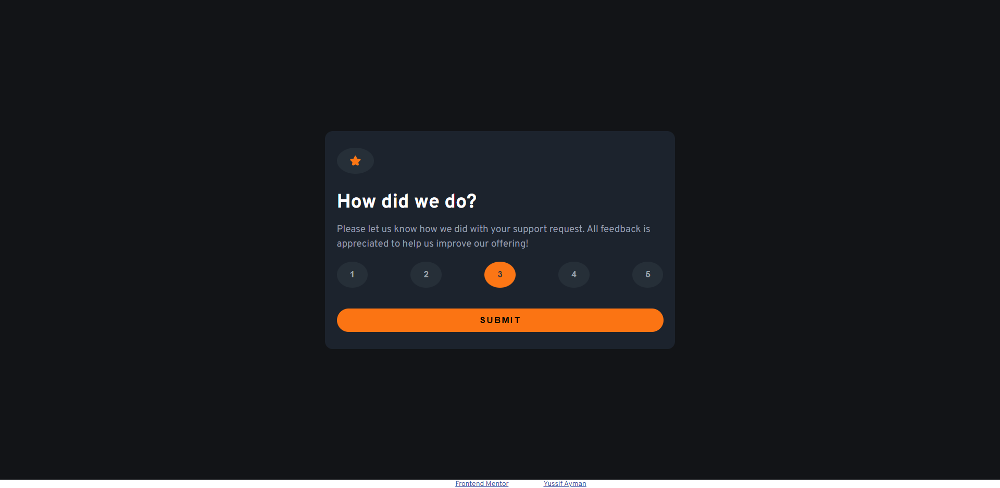
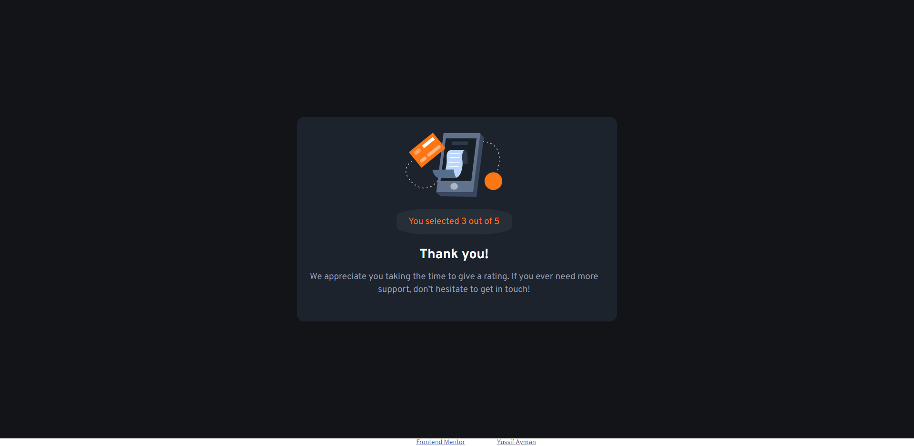

# Frontend Mentor - Interactive rating component solution

This is a solution to the [Interactive rating component challenge on Frontend Mentor](https://www.frontendmentor.io/challenges/interactive-rating-component-koxpeBUmI). Frontend Mentor challenges help you improve your coding skills by building realistic projects.

## Table of contents

- [Overview](#overview)
  - [The challenge](#the-challenge)
  - [Screenshot](#screenshot)
  - [Links](#links)
- [My process](#my-process)
  - [Built with](#built-with)
  - [What I learned](#what-i-learned)
  - [Continued development](#continued-development)
  - [Useful resources](#useful-resources)
- [Author](#author)
- [Acknowledgments](#acknowledgments)

**Note: Delete this note and update the table of contents based on what sections you keep.**

## Overview

### The challenge

Users should be able to:

- View the optimal layout for the app depending on their device's screen size
- See hover states for all interactive elements on the page
- Select and submit a number rating
- See the "Thank you" card state after submitting a rating

### Screenshot





### Links

- Solution URL: [github link](https://github.com/Yussif20/interactive-rating-component)
- Live Site URL: [live site url](https://yussif20.github.io/interactive-rating-component/)

### Built with

- Semantic HTML5 markup
- CSS custom properties
- Flexbox
- Javascript

### What I learned

I'm happy to apply what I have learned so far about DOM manipulation and finding out how it can be very tricky and below is a simple function that made me do alot of search to figure it out and I am proud to finally do :)

```js
[...ratingNumbers].map((num) => {
  num.addEventListener("click", () => {
    const activeEl = document.querySelector(".active");
    if (activeEl) {
      activeEl.classList.remove("active");
    }
    num.classList.add("active");
  });
});
```

## Author

- Website - [Yusif Ayman](https://yussif20.github.io/main-portfolio/)
- linkedin - [Yusif Ayman](https://www.linkedin.com/in/yussif-ayman/)
- Github - [Yusif Ayman](https://github.com/Yussif20)
- Frontend Mentor - [Yusif ayman](https://www.frontendmentor.io/profile/Yussif20)
